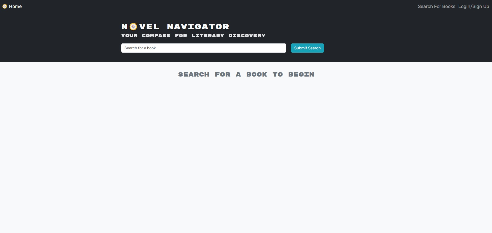
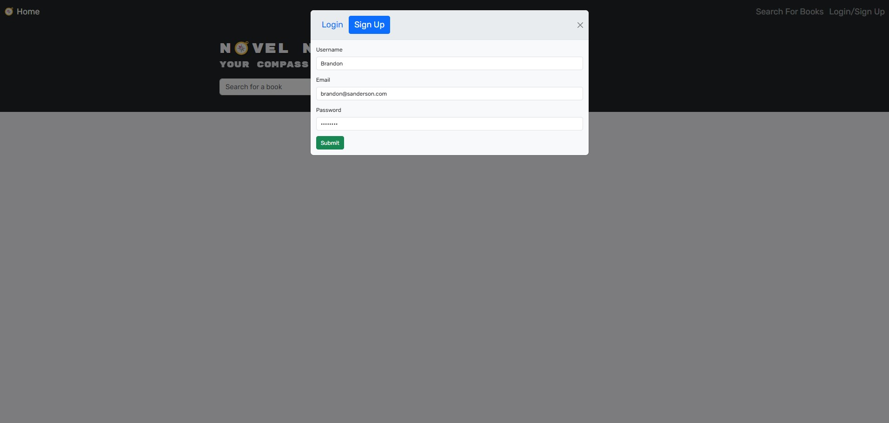
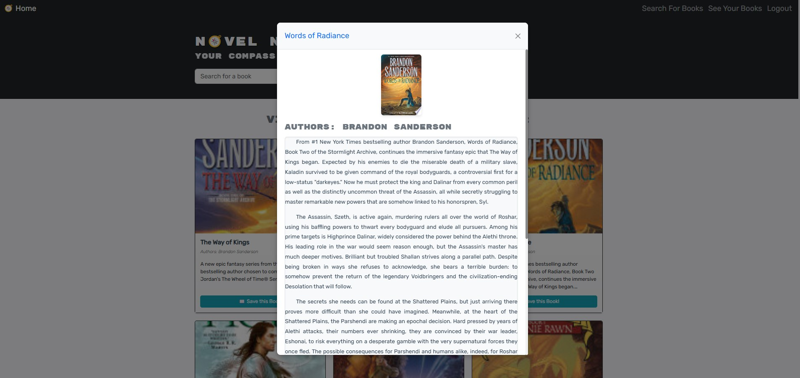
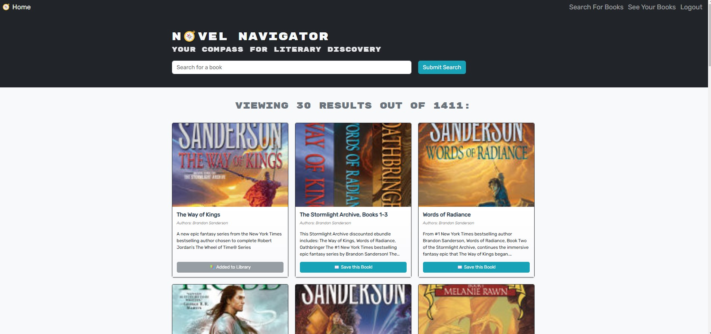
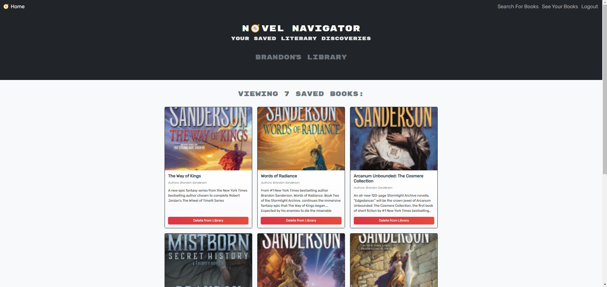

# Novel-Navigator

## Description
Novel Navigator is a book search app that uses the Google Books API to allow users to search for books they may be interested in and save it to their own accounts created in the app. When they are all done with their books they can remove them from their list and go search for more to add to their list!

## Table of Contents
- [Installation](#installation)
- [Usage](#usage)
- [License](#license)
- [Contributing](#contributing)
- [Tests](#tests)
- [Questions](#questions)

## Installation
This app uses Node, Express, Typescript,  MongoDB, Mongoose, GraphQL, JSON Web Token, and the GoogleBooks API. Make sure to do an npm install to get access to all of the necessary node modules as well as create your own gitignore. You will also need to create you're own environment folder for your own MONGODB_URI and JWT_SECRET_KEY.

## Usage
When you first open this up, you are presented with a search bar along with a navigation bar at the top where you can either login or sign up for an account. If you do not need to save any books to keep track of, then you can simply enter your book in the search bar and click submit search to be presented with a list that should include that book and other related books. 

To login or sign up, press the link in the navbar at the top. A modal will pop up, either enter your email and password set up prior to login, or click sign up and enter your username, email address, and password, then click submit.

Once you have logged in you can then search for books. After submitting your search a list of books will appear showing 30 results at a time. You can click on the book to have a modal pop up showing you the full image as well as the full description. If you find one you like you can click Save this Book at the bottom of the book card and it will then be added to the library. You can either keep searching by clicking to the next page at the bottom of the list, or if you want to see your library of books, you can click the see your books link in the nav bar at the top.

Once on your library page you can scroll through all of your saved books, click on them for that pop up modal again, or delete them by clicking the Delete from Library button at the bottom of the card. If you would like to keep searching you can either click the Search for Books link or the Home link, both at the top in the navbar. When you are all finished you can click logout or simply exit the page!

  ## License
    MIT
    
  https://opensource.org/licenses/MIT

## Contributing
N/A

## Tests
N/A

https://drive.google.com/file/d/1nforc0ktOodGv15P-7Cc1CdCoKBbjRFF/view?usp=sharing

## Questions
GitHub: [pauletters](https://github.com/pauletters)
Email: pauletters87@gmail.com

© 2024 Novel Navigator Team Confidential and Proprietary. All Rights Reserved.
